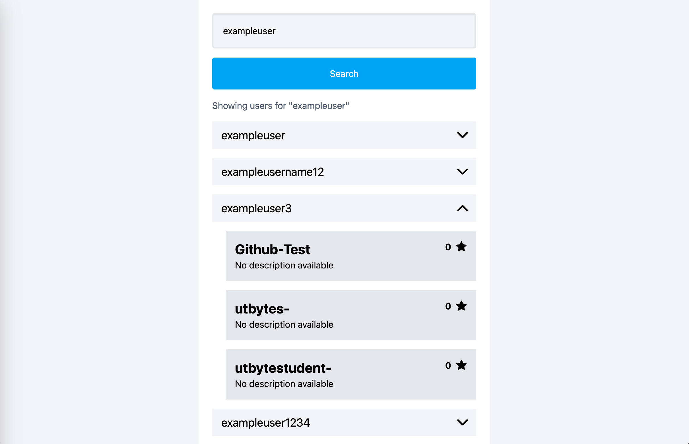
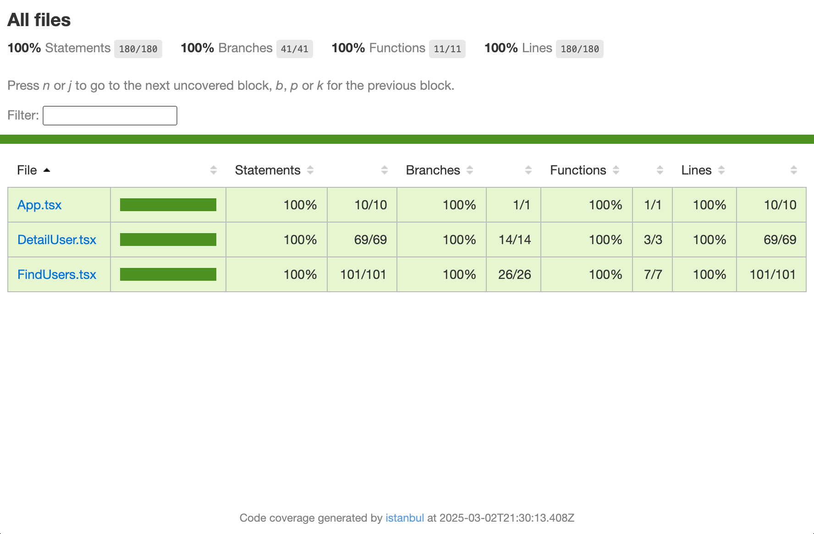

# GitHub Repositories Explorer



[Live Demo](https://argadeva.github.io/github-repositories-explorer/)

This project is a GitHub Repositories Explorer that allows users to search and explore GitHub repositories.

## Features

- Search GitHub users by username
- View user repositories with details
- Infinite scroll pagination
- Responsive design with Tailwind CSS
- Error handling and loading states
- Automated testing with Vitest

## Tech Stack

- React 19
- TypeScript
- Vite
- TanStack Query (React Query)
- Tailwind CSS
- Vitest + Testing Library
- ESLint + Prettier

## Installation

1. Clone the repository:
  ```sh
  git clone https://github.com/your-username/github-repositories-explorer.git
  ```
2. Navigate to the project directory:
  ```sh
  cd github-repositories-explorer
  ```
3. Install dependencies:
  ```sh
  npm install
  ```

## Usage

1. Start the development server:
  ```sh
  npm run dev
  ```
2. Open your browser and navigate to `http://localhost:3000`

## Project Structure
```sh
src/
  ├── __tests__/      # Test files
  ├── assets/         # SVG icons and assets
  ├── types/          # TypeScript type definitions
  ├── utils/          # API and utility functions
  ├── App.tsx         # Root component
  ├── FindUsers.tsx   # User search component
  └── DetailUser.tsx  # Repository details component
```

## Test Coverage

The project maintains high test coverage to ensure code quality and reliability. Below is the latest coverage report:



You can find detailed coverage reports in the `coverage` directory after running:
```sh
npm run test:coverage
```

## Available Scripts
```sh
npm run dev - Start development server
npm run build - Build for production
npm run preview - Preview production build
npm run test - Run tests
npm run test:coverage - Run tests with coverage
npm run lint - Run ESLint
npm run lint:fix - Fix ESLint issues
npm run format - Format code with Prettier
npm run format:check - Check code formatting
```